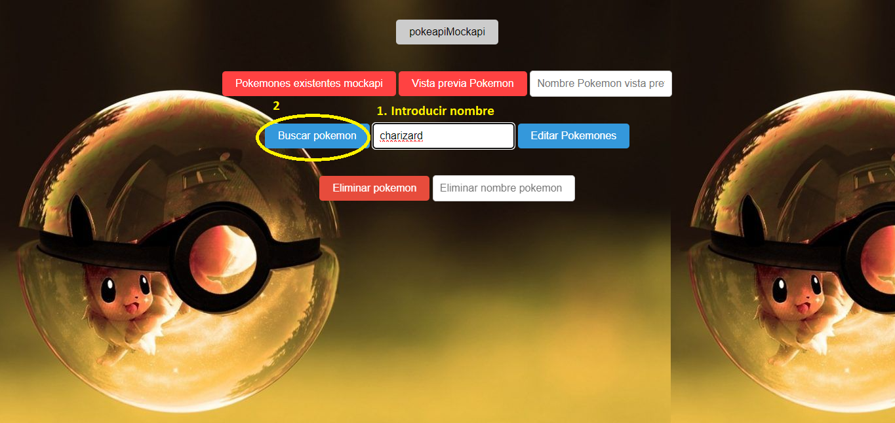
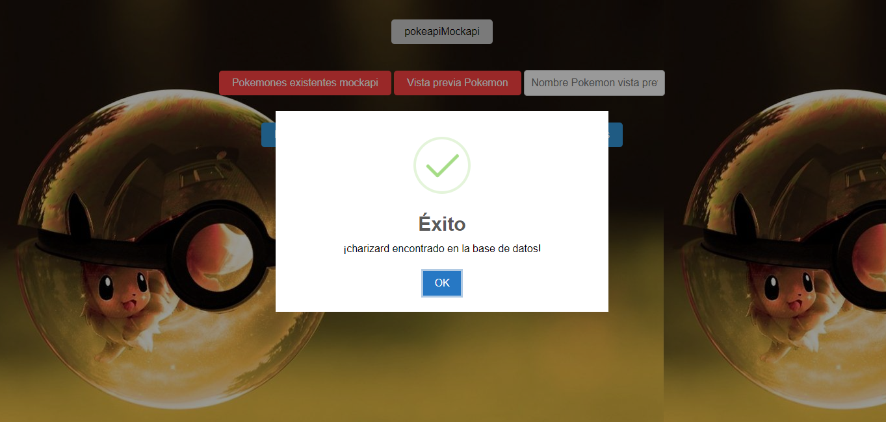
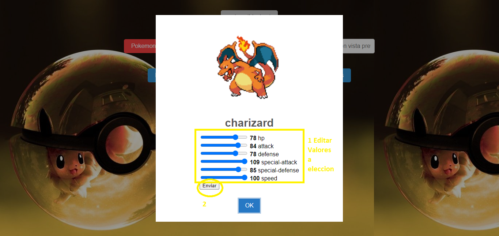
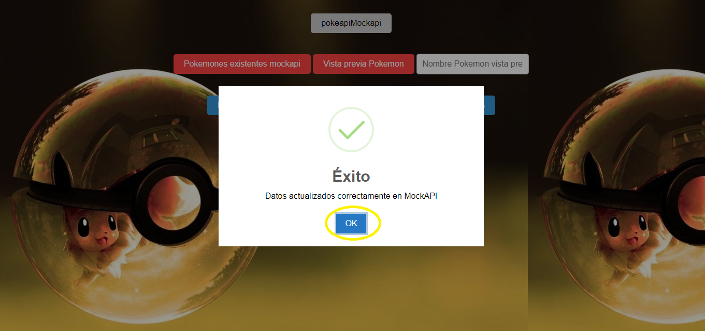
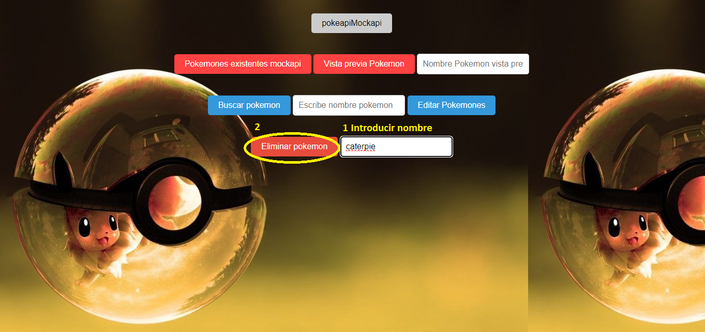
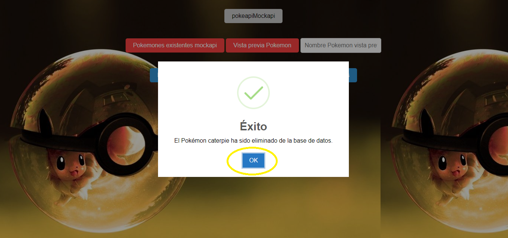

# API Pokemon

**Autor:**

- Kevin Johan Jimenez Delgado

## Descripción del Proyecto

Este proyecto interactua con una api `https://pokeapi.co/`, en el cual los primeros 10 pokemones con su id me los envía a una página mockapi para que se pueda interactuar con ellos, el proyecto me permite ver en consola los pokemones existentes en la mockapi, ver una vista previa de como se verán los pokemones (en este caso pikachu), buscar un pokemon y si lo encuentra dejarme editar los datos, y por último eliminar pokemones por nombre.

## Tecnologías Utilizadas

- HTML
- CSS
- JavaScript
- Interactuar con APIs, PokeApi, MockApi y sweetalert2 `https://sweetalert2.github.io/`
- Métodos como PUSH, DELETE, POST
- Eventos de escucha como addEventListener

## Instrucciones de Uso

1. Abre el archivo `index.html` en tu navegador para visualizar el proyecto, se verá de la siguiente forma:

2. Para realizar acciones en la api, se utiliza las siguientes funcionalidades, de acuerdo a los nombres de los botones:

   - **pokeapiMockapi:** Como los nombres de los pokemones se pueden obtener de acuerdo al siguiente link  `https://pokeapi.co/api/v2/pokemon/ditto` siendo ditto un numero empezando desde 1, lo que hace este botón es primero extraer los datos de los 10 primeros pokemones encontrados en la api (junto con su id, name, hp, attack, defense, specialAttack, specialDefense y speed) y luego enviarlos a la mockapi `https://6512485eb8c6ce52b3957baa.mockapi.io/pokemon` para posteriormente ser editados. Por defecto aparece desabilitado porque solo me interesa que se envíen estos datos una sola vez

   - **Pokemones existentes mockapi:** Como se va a pedir prácticamente los nombres de los pokemones para hacer varias operaciones, este botón me muestra en consola los pokemones existentes en mockapi, para que el usuario sepa con cuales puede interactuar

   

   - **Vista previa pokemon** Este botón muestra por defecto como se vería el pokemon si uno ingresa su nombre respectivo en la sección de "Nombre Pokemon vista previa" (imagen, name, hp, attack, defense, specialAttack, specialDefense y speed). Si encuentra el pokemon me muestra una vista previa del pokemon seleccionado desde el mockapi, en caso de que no, me dice que no se encuentra en la base de datos.

   

   

   - **Buscar pokemon:** Lo primero que se debe hacer es escribir el nombre del pokemon que se desea editar en el apartado "Escribe nombre pokemon", si no se encuentra en mockapi, me envía un mensaje diciendo que no se encuentra en la base de datos y sigue desabilitado el botón de "Editar Pokemones", pero si el nombre si se encuentra, se me habilita el botón de "Editar Pokemones"

   

   

   

   - **Editar Pokemones:** Este se habilita cuando se encuentra el nombre ingresado por el usuario en mockapi, de ahí el usuario puede mover sus datos a su elección para editarlos (hp, attack, defense, specialAttack, specialDefense y speed) y darle en el botón "enviar", al hacer esto, el botón "Editar Pokemones" se vuelve a desabilitar (NOTA: Aunque carga los datos de acuerdo a la pokeapi, de todos modos como se va a editar los datos, no lo vi necesario que se vea los datos desde la mockapi, de todos modos verifica si la id existe en la mockapi y envia esos datos en la mockapi)

   - **enviar:** Este solo aparece cuando ya se encuentra en el apartado de editar, y es para enviar los nuevos datos a la mockapi para editarlos

   

   

   - **Eliminar pokemon:** Lo primero que se debe hacer es escribir el nombre del pokemon que se desea eliminar en el apartado "Eliminar nombre pokemon", si no se encuentra en mockapi, me envía un mensaje diciendo que no se encuentra en la base de datos, pero si el nombre si se encuentra, me lo elimina del mockapi

   

   

## NOTA

- **Ver proyecto:** Abrir con ver en vivo u open with live server

- **Actualizar Pagina:** Se recomienda que la primera vez que se abra la página, se vuelva a actualizar y de ahí ya se puede interactuar

